# Pose ControlNet from the command line (`--pose-image`, `models import-controlnet`)

日本語版: [POSE_IMAGE_ja.md](POSE_IMAGE_ja.md)

This fork adds two things to `draw-things-cli` so that a Pose (OpenPose) ControlNet
can actually be used from the command line:

1. `generate --pose-image <skeleton.png>` — passes a pre-rendered OpenPose skeleton
   to the generation engine as a `pose` control hint.
2. `models import-controlnet <file.safetensors>` — converts an external ControlNet
   (for example an OpenPose SDXL model from Hugging Face) into the Draw Things
   checkpoint format and registers it in `custom_controlnet.json`.

Both pieces already existed inside the engine; the CLI just had no way to reach them.
Everything else (the GUI app, the engine, the model formats) is unchanged. The whole
change is in `Apps/DrawThingsCLI/DrawThingsCLI.swift` (+123 / -2 lines).

Contents: [Purpose](#purpose) · [Problems found](#problems-found) · [Build](#1-build-the-cli) ·
[Base model](#2-get-and-import-a-base-model) · [ControlNet](#3-get-and-import-a-pose-controlnet) ·
[Skeleton](#4-make-a-skeleton-image) · [Generate](#5-generate) ·
[Command reference](#command-reference) · [Results](#results) · [Limitations](#limitations)

## Purpose

Pose ControlNet on an Illustrious-type SDXL model does nothing when driven from
`draw-things-cli`, and no error message says why. This fork is the result of tracing
that with the open-source command-line build and making it work from the CLI. The
intent is:

- to give CLI users a working way to drive a Pose ControlNet on SDXL / Illustrious
  models (`--pose-image` plus an import path for external ControlNets),
- to document, in one place, every silent failure met on the way.

Both additions call code that already exists in the engine; the patch touches one
file. This fork is not submitted upstream.

The investigation notes (in Japanese, with all intermediate experiments and the wrong
turns) live in a separate repository:
[rabbit-holes/drawthings-controlnet](https://github.com/hisashi-ito/rabbit-holes/tree/main/drawthings-controlnet).

## Problems found

None of these produce an error or a warning. They stack, which is why the symptom
("ControlNet does nothing" or "the output is noise") is so hard to trace.

| # | Problem | Where | Effect | Handled by |
|---|---|---|---|---|
| 1 | The CLI never passes a `pose` hint. Its only hint type is audio, so the engine's Pose branch is unreachable from the command line. | `Apps/DrawThingsCLI/DrawThingsCLI.swift` | A Pose ControlNet in `--config-json` silently has no effect. | `--pose-image` (this fork) |
| 2 | No Pose ControlNet for standard SDXL / Illustrious in the official model list, and no CLI command to import one, although `ControlNetImporter` exists in the repository. | model list, CLI | Nothing to configure even if #1 were fixed. | `models import-controlnet` (this fork) |
| 3 | The CLI image loader yields `[-1, 1]`, control hints are consumed in `[0, 1]`. | CLI vs. engine convention | A skeleton passed in `[-1, 1]` makes the hint network output about 50,000 instead of about 5; the generation degrades into colour noise. | Range conversion inside `--pose-image` |
| 4 | `models import` links merged Illustrious-type checkpoints to the generic shared CLIP / VAE instead of the embedded ones ([issue #107](https://github.com/drawthingsai/draw-things-community/issues/107), open). | `ModelImporter` | Pure noise for every prompt, with or without ControlNet. | Workaround: extract the companions and pass them explicitly (`docs/extract_sdxl_companions.py`) |
| 5 | A control whose file is missing, unregistered, or registered twice under different modifiers is dropped without a message. | `LocalImageGenerator` guard chain, `custom_controlnet.json` | "Nothing happens" runs that look like #1. | Documented (checklist in step 5); not changed |
| 6 | The official "Xinsir Union ProMax" in `pose` mode does not reproduce arm poses. | union control path | Pose partly ignored. | Use a dedicated OpenPose model |
| 7 | `controlImportance: control` can leave the pose ignored (user report, GUI and CLI alike). The mode applies the residuals to the conditional half only, scaled by 0.825^(12-i); in the sweep here it still worked at 1024 (Figure 4), so the outcome depends on the setup. | `ControlModel.swift` | Pose ignored with no message. | Use `balanced` |

## 1. Build the CLI

Requirements: macOS (Apple Silicon or Intel), Xcode command line tools
(`xcode-select --install`), Swift 5.10 or newer (`swift --version`), git, about 10 GB
of free disk for the build products. Python 3 is used only by the helper script in
step 2.

```bash
git clone https://github.com/hisashi-ito/draw-things-community.git
cd draw-things-community
swift build -c release --product draw-things-cli
```

The first build fetches the Swift package dependencies and compiles the whole engine;
expect 20–40 minutes (about 8 minutes for a rebuild after touching a library). The
binary is `.build/release/draw-things-cli`. In the commands below it is written as
`draw-things-cli`; either put `.build/release` on your `PATH` or use the full path.

Pick a models directory and pass it as `--models-dir` to every command (or export
`DRAWTHINGS_MODELS_DIR`). Without it the CLI uses the GUI app's container folder
`~/Library/Containers/com.liuliu.draw-things/Data/Documents/Models`.

```bash
export DRAWTHINGS_MODELS_DIR=~/dt-models
mkdir -p "$DRAWTHINGS_MODELS_DIR"
```

## 2. Get and import a base model

Any SDXL checkpoint works. We used WAI-Illustrious v11 (6.9 GB; the file is
`waiNSFWIllustrious_v110.safetensors` on the mirror, renamed to `waiIllustrious_v110.safetensors`
below), downloaded from the Hugging Face mirror
[guy39/wai-nsfw-illustrious-sdxl-v11.0](https://huggingface.co/guy39/wai-nsfw-illustrious-sdxl-v11.0)
(the original is on Civitai). The official SDXL base from Draw Things
(`sd_xl_base_1.0_q6p_q8p.ckpt`) also works and is fetched automatically with
`draw-things-cli models ensure --model sd_xl_base_1.0_q6p_q8p.ckpt`.

Importing a merged Illustrious-type checkpoint with `models import` alone produces
pure noise at generation time
([issue #107](https://github.com/drawthingsai/draw-things-community/issues/107)):
the importer links the model to the generic shared CLIP / VAE files instead of the
ones embedded in the checkpoint. The workaround is to split the embedded CLIP-L,
CLIP-G and VAE out of the checkpoint and pass them explicitly. The helper script
[`extract_sdxl_companions.py`](extract_sdxl_companions.py) (pure Python, no
dependencies) does that:

```bash
python3 docs/extract_sdxl_companions.py ~/Downloads/waiIllustrious_v110.safetensors
# writes clip_l.safetensors, clip_g.safetensors, vae.safetensors next to the checkpoint

draw-things-cli models import ~/Downloads/waiIllustrious_v110.safetensors \
  --models-dir "$DRAWTHINGS_MODELS_DIR" \
  --name "WAI-Illustrious v11" \
  --autoencoder ~/Downloads/vae.safetensors \
  --text-encoder ~/Downloads/clip_l.safetensors \
  --text-encoder-2 ~/Downloads/clip_g.safetensors \
  --replace
```

The import takes several minutes (it rewrites 6.9 GB) and prints the internal file
name, here `waiillustrious_v110_f16.ckpt`, plus model-specific companion files
(`waiillustrious_v110_clip_vit_l14_f16.ckpt`, `..._open_clip_vit_bigg14_f16.ckpt`,
`..._vae_f16.ckpt`). If the companions are named `clip_vit_l14_f16.ckpt` /
`open_clip_vit_bigg14_f16.ckpt` / `sdxl_vae_v1.0_f16.ckpt` instead, the explicit
files were not picked up and generation will produce noise.

Note for Intel Macs: the engine's float type is 32-bit there, so imported files are
written as fp32 (`waiillustrious_v110_f16.ckpt` is 10.3 GB instead of 5.1 GB). They
work; they are just larger. On Apple Silicon the files are fp16.

## 3. Get and import a Pose ControlNet

Download the OpenPose SDXL ControlNet from
[xinsir/controlnet-openpose-sdxl-1.0](https://huggingface.co/xinsir/controlnet-openpose-sdxl-1.0):

```bash
curl -L -o ~/Downloads/openpose_sdxl_xinsir.safetensors \
  https://huggingface.co/xinsir/controlnet-openpose-sdxl-1.0/resolve/main/diffusion_pytorch_model.safetensors
# 2.5 GB, fp16, diffusers layout
```

Import it with the new subcommand:

```bash
draw-things-cli models import-controlnet ~/Downloads/openpose_sdxl_xinsir.safetensors \
  --models-dir "$DRAWTHINGS_MODELS_DIR" \
  --name "OpenPose SDXL (xinsir)" \
  --modifier pose
```

Output:

```
Importing ControlNet: openpose_sdxl_xinsir.safetensors

FIELD      VALUE
---------  -----------------------------
FILE       openpose_sdxl_xinsir_ctrl_f16.ckpt
NAME       OpenPose SDXL (xinsir)
VERSION    sdxlBase
TYPE       controlnet
MODIFIER   pose

Registered in custom_controlnet.json.
```

`FILE` is the name to use in the generation config. The importer detects the model
version and the transformer block layout itself; `--modifier` tells the engine which
kind of hint the model consumes and must be `pose` for an OpenPose model.

The official "Xinsir Union ProMax (SDXL)" from the Draw Things model list
(`controlnet_xinsir_union_promax_sdxl_1.0_f16.ckpt`, type `controlnetunion`) can be
used the same way with `"inputOverride": "pose"`, but it does not reproduce arm poses.
Use a dedicated OpenPose model.

## 4. Make a skeleton image

The CLI does not extract skeletons from photos. You need an OpenPose-style render:
coloured limbs on a black background, RGB, ideally at the generation size (it is
resized otherwise). Any of these work:

- the Draw Things app's Pose tab (draw or detect a pose, export the image),
- `controlnet_aux`'s `OpenposeDetector` in Python, run on a photo,
- an OpenPose editor (web editors and the Automatic1111 "openpose editor" extension
  both export this format),
- draw it yourself with the standard OpenPose colours.
  [`draw_openpose.py`](draw_openpose.py) renders the 18-keypoint skeleton from a list of
  joint positions; [`images/openpose_tpose.png`](images/openpose_tpose.png),
  [`images/tpose_1024.png`](images/tpose_1024.png) and
  [`images/peace_1024.png`](images/peace_1024.png) were made with it.

The values do not need to be exact; the model was trained on OpenPose renders, so
stick to that look (limb width about 1% of the image, joints as small discs).

## 5. Generate

```bash
draw-things-cli generate \
  --models-dir "$DRAWTHINGS_MODELS_DIR" \
  --model waiillustrious_v110_f16.ckpt \
  --prompt "1girl, solo, long hair, school uniform, standing, smiling, simple background, masterpiece, best quality" \
  --negative-prompt "worst quality, low quality, blurry" \
  --seed 777 --steps 25 --cfg 6 --width 1024 --height 1024 \
  --pose-image docs/images/tpose_1024.png \
  --config-json '{"controls":[{"file":"openpose_sdxl_xinsir_ctrl_f16.ckpt","weight":1.0,"guidanceStart":0.0,"guidanceEnd":0.6,"noPrompt":false,"globalAveragePooling":false,"downSamplingRate":1.0,"controlImportance":"balanced","targetBlocks":[],"inputOverride":"pose"}]}' \
  --output out.png
```

What each argument does:

| Argument | Meaning |
|---|---|
| `--models-dir` | Models directory (or `DRAWTHINGS_MODELS_DIR`). |
| `--model` | Base model file name as printed by `models import`. |
| `--prompt`, `--negative-prompt` | Usual text conditioning. |
| `--seed` | Fix it to compare runs with and without the ControlNet. |
| `--steps` | 10 is enough to see the pose; 20–30 for final images. |
| `--width`, `--height` | Multiples of 64. 512 was used for all tests here; 1024 is the native SDXL size. |
| `--pose-image` | The skeleton image. New in this fork. Resized to the output size, converted to the `[0, 1]` range, and passed as the `pose` hint. |
| `--config-json` | Inline JSON in `JSGenerationConfiguration` format. The `controls` array is where the ControlNet is configured (see below). |
| `--output` | Output PNG. |

Fields of a `controls[]` entry:

| Field | Value used | Meaning |
|---|---|---|
| `file` | `openpose_sdxl_xinsir_ctrl_f16.ckpt` | Checkpoint name as registered in `custom_controlnet.json`. |
| `inputOverride` | `pose` | Which hint the model receives. Must be `pose` for a skeleton. |
| `weight` | `1.0` | Strength. |
| `guidanceStart`, `guidanceEnd` | `0.0`, `0.6` | Fraction of the steps during which the ControlNet is applied. |
| `controlImportance` | `balanced` | `balanced`, `prompt` or `control`. Keep `balanced`. `control` is the A1111 "ControlNet is more important" mode: the residuals are applied to the conditional half of the batch only and scaled per layer by 0.825^(12-i) (`ControlModel.swift`), which cuts the high-resolution residuals to about a tenth. It reproduced the T-pose in the 1024 sweep here (Figure 4), but a user reported that with `control` the pose is ignored entirely on their setup, in the GUI and in this CLI alike, and that `balanced` fixed it. If a pose is ignored, check this field first. |
| `noPrompt`, `globalAveragePooling`, `downSamplingRate`, `targetBlocks` | `false`, `false`, `1.0`, `[]` | Defaults. |

Silent-failure checklist, in case nothing happens:

- The `file` must exist in the models directory and be listed in
  `custom_controlnet.json`; otherwise the engine drops the control without a message.
- File names in `custom_controlnet.json` must be unique; with duplicates the last
  entry wins.
- Without `--pose-image` the Pose branch falls back to passing the `--image` reference
  picture through as the hint, which is not a skeleton.
- Compare against a run without `controls`: with the same seed, a working ControlNet
  changes most pixels. A one-liner for that check:

```bash
python3 -c "
from PIL import Image; import numpy as np
a=np.asarray(Image.open('out.png').convert('RGB')).astype(int); b=np.asarray(Image.open('baseline.png').convert('RGB')).astype(int)
d=abs(a-b); print(f'{(d.max(2)>30).mean()*100:.1f}% of pixels changed, mean abs diff {d.mean():.1f}/255')"
```

## Command reference

`draw-things-cli models import-controlnet --help`:

```
USAGE: draw-things-cli models import-controlnet [--models-dir <models-dir>] <artifact> [--name <name>] [--modifier <modifier>] [--replace]

ARGUMENTS:
  <artifact>              Local ControlNet artifact (.safetensors or .ckpt).

OPTIONS:
  --models-dir <models-dir>
                          Models directory.
        Resolution order: --models-dir, DRAWTHINGS_MODELS_DIR, then on macOS
        ~/Library/Containers/com.liuliu.draw-things/Data/Documents/Models.
  --name <name>           Display name for the imported ControlNet.
  --modifier <modifier>   Control hint type this model consumes (pose, canny,
                          depth, scribble, softedge, lineart, normalbae, seg,
                          tile, color, custom).
  --replace               Overwrite an existing imported ControlNet with the
                          same id.
```

`draw-things-cli generate --help`, the new option:

```
  --pose-image <pose-image>
                          OpenPose skeleton image for Pose ControlNet.
        Pass a pre-rendered OpenPose skeleton map (the app does not extract
        skeletons from photos). Without this, a Pose ControlNet receives no
        skeleton and silently has no effect.
```

## Results

It works. With the imported xinsir OpenPose model, `--pose-image` and the settings from
step 5, the generated character takes the pose of the skeleton.

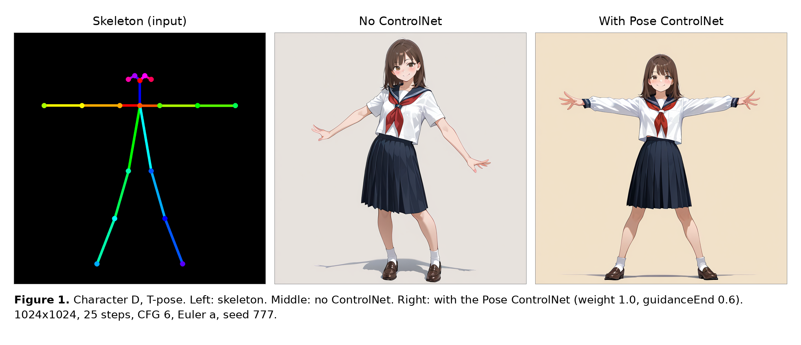

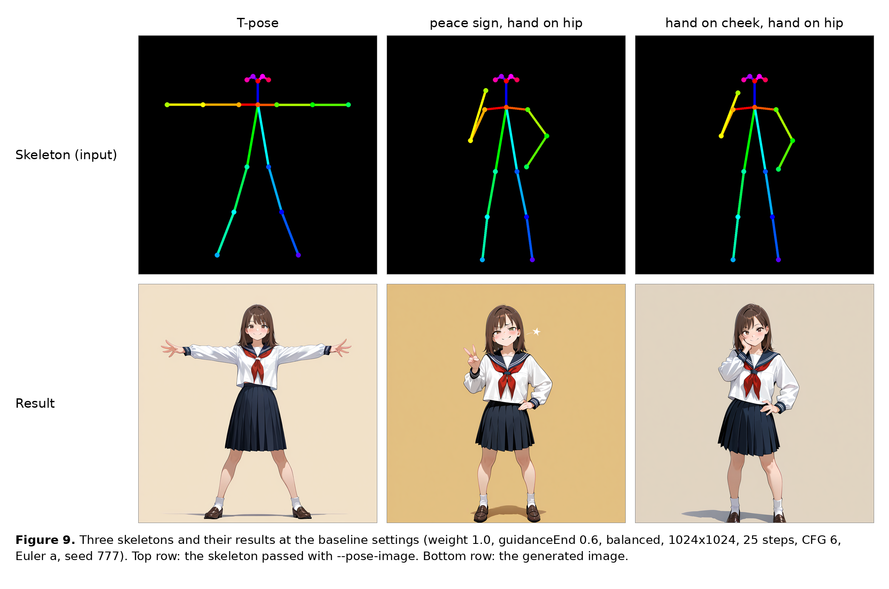

All images in this section: WAI / Illustrious v11 (SDXL), 1024×1024, 25 steps, CFG 6,
Euler a, seed 777, generated on a MacBook Air (M4, 16 GB) with this branch. Prompt:
`masterpiece, best quality, amazing quality, 1girl, solo, medium hair, brown hair, brown eyes,
serafuku, school uniform, standing, <pose tags>, smile, looking at viewer, full body, simple
background`; negative: `bad quality, worst quality, worst detail, sketch, censor, nsfw, bad
anatomy, bad hands, extra digits, deformed, ugly`. Pose tags: `arms spread` (T-pose),
`v, hand on hip, smug` (peace sign), `hand on own cheek, hand on hip` (hand on cheek).
Generation time: about 3 minutes per 1024×1024 image at 25 steps.

The background, framing and shading change too, not only the pose: the ControlNet
alters the whole denoising path during the steps it is applied, and the same seed only
fixes the initial noise. Anything the prompt leaves open (here "simple background") is
decided anew. To keep a background, name it in the prompt.

### Parameter dependence

One parameter at a time from the baseline (weight 1.0, `guidanceEnd` 0.6, `balanced`,
1024×1024, 25 steps, CFG 6, Euler a), for two skeletons: the T-pose (which the prompt
alone does not produce, see Figure 1) and the peace sign (which the prompt alone already
produces; the skeleton then mostly fixes the stance and the position of the arms).

Summary: at 1024×1024 the pose is reproduced for every value tried. None of weight,
`guidanceEnd`, `controlImportance`, steps, CFG or sampler breaks it. The only parameter
that visibly matters is the resolution: at 512×512 the pose still follows the skeleton,
but colour and texture degrade (the model card recommends 1024 or larger).

| Parameter | Baseline | Range tried | Effect on the pose | Side effects |
|---|---|---|---|---|
| `weight` | 1.0 | 0.5, 0.7, 0.85, 1.0, 1.2 | none; pose reproduced at every value | 1.2 starts to shift colours (darker uniform / background) |
| `guidanceEnd` | 0.6 | 0.3, 0.5, 0.6, 0.8, 1.0 | none | 0.3 changes the picture slightly (control stops early); 1.0 gives no halo at 1024 |
| `controlImportance` | balanced | balanced, prompt, control | none | negligible |
| resolution | 1024 | 512, 768, 1024 | none; pose follows at all three | 512: flat face, rough colours; 768 and 1024 clean |
| steps | 25 | 10, 20, 25, 30 | none; pose already there at 10 | more steps refine detail only |
| CFG | 6 | 4, 6, 8 | none | 8 slightly saturates colours |
| sampler | Euler a | Euler a, DPM++ 2M Karras, DPM++ SDE Karras | none | DPM++ SDE takes twice as long (6 min vs 3) |

Pixel-level difference against the no-ControlNet image with the same settings: about
15% of the pixels (mean absolute difference 20–30/255) for every 1024 variant of the
T-pose; 95% at 512 (the whole picture changes there, not only the pose).

T-pose:

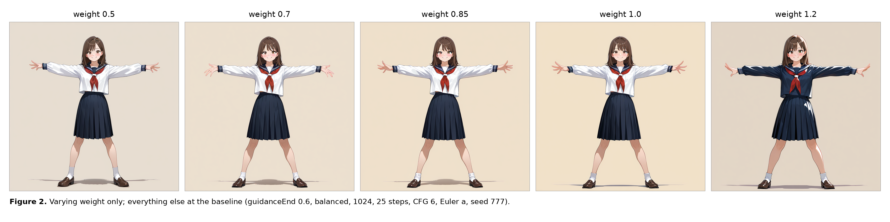

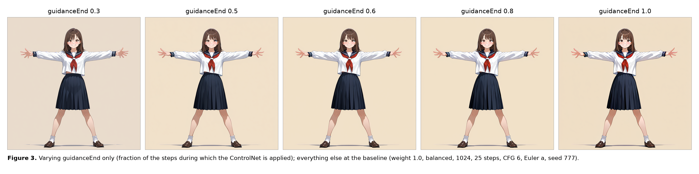

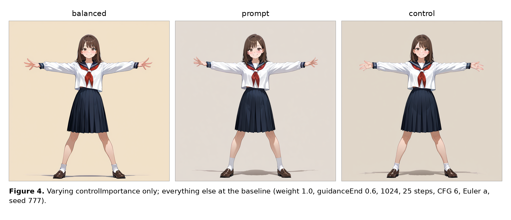

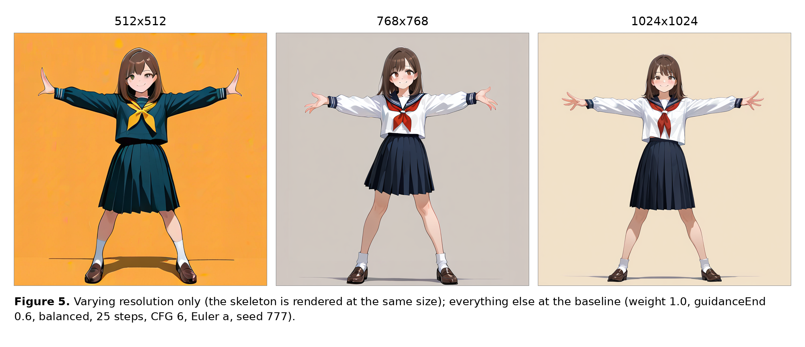

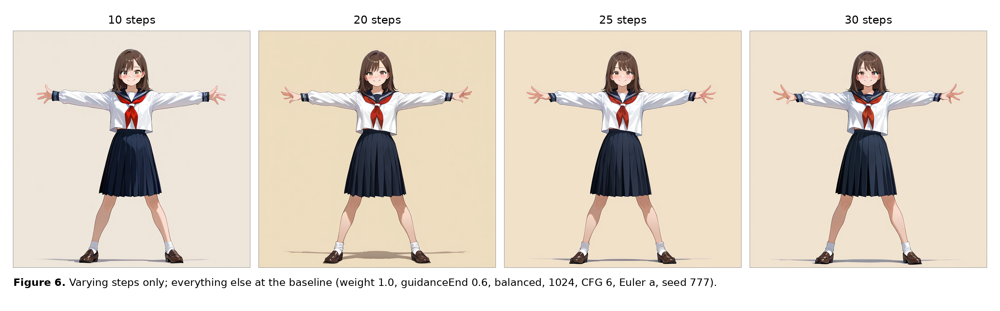

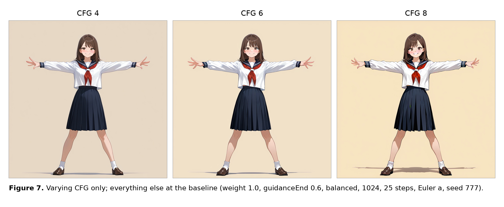

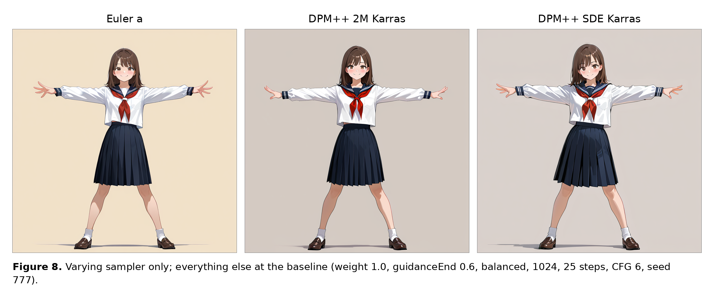

Peace sign:

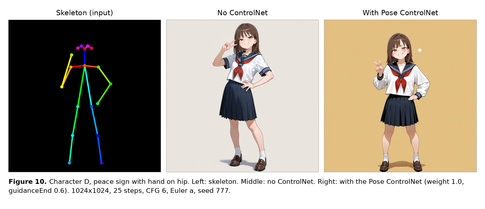

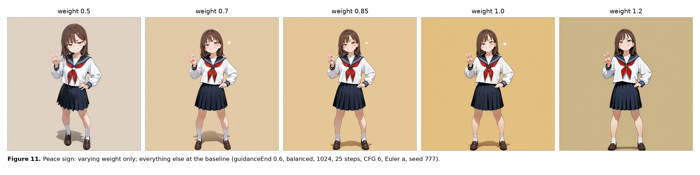

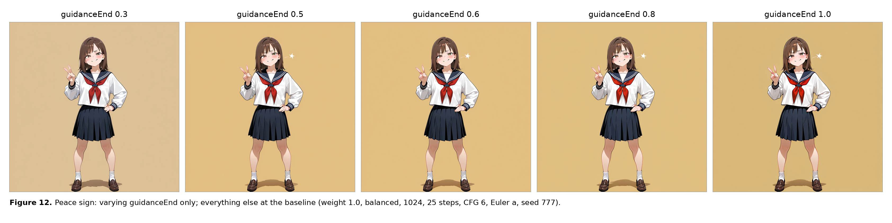

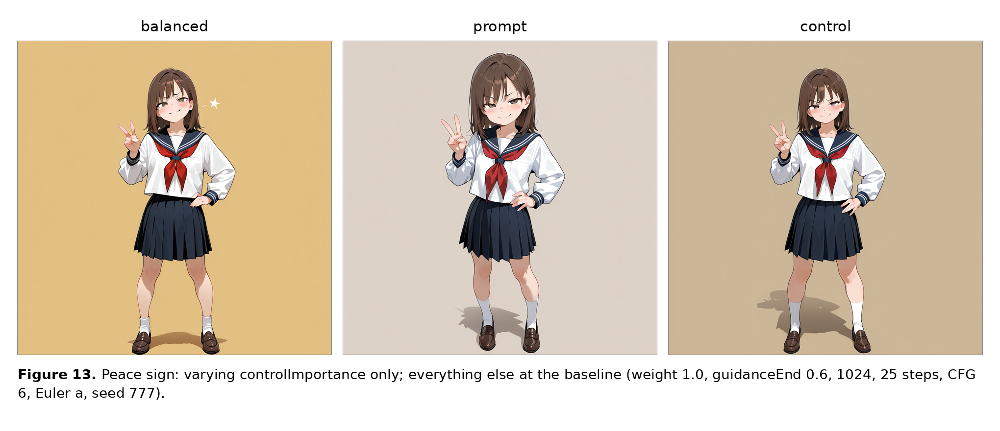

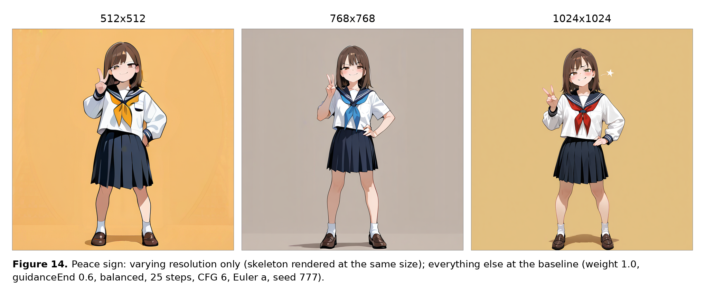

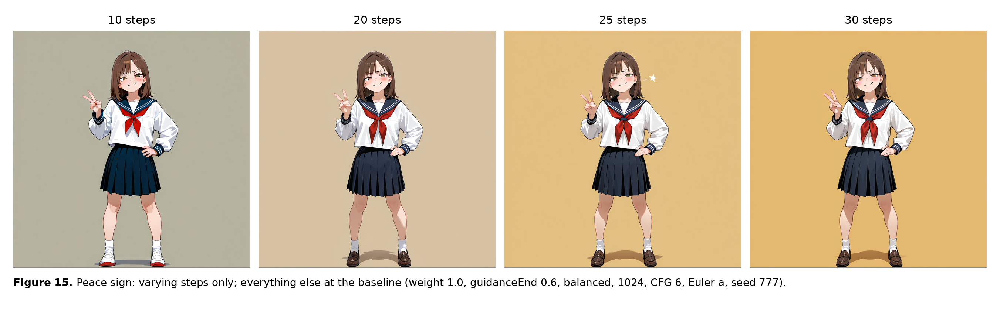

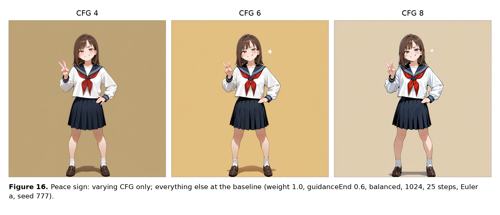

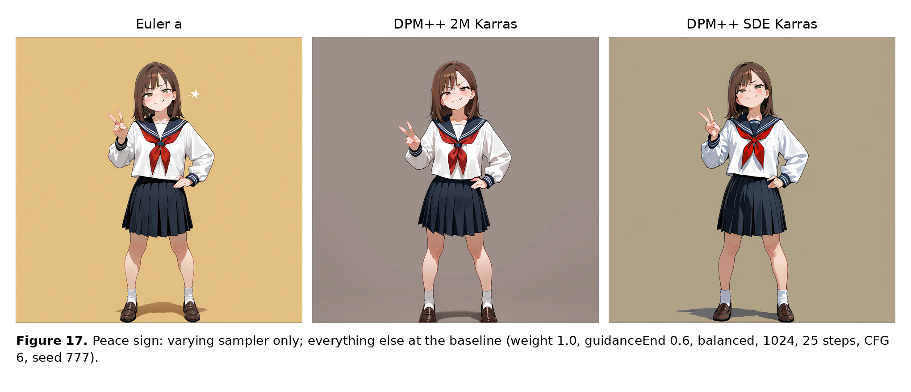

## Limitations

- No skeleton extraction from photos. The skeleton has to be rendered outside the CLI.
- Tested with the WAI / Illustrious SDXL checkpoint on an Intel Mac (512×512, fp32
  imports, about 5 minutes per step) and on a MacBook Air M4 (512–1024, fp16 imports,
  about 6 seconds per step at 1024). On Intel Macs the engine's float type is 32-bit, so
  imported files are twice the size of the fp16 files the app distributes; they work.
- The official "Xinsir Union ProMax (SDXL)" model in `pose` mode does not reproduce arm
  poses. Use a dedicated OpenPose model.
- The GUI app is closed source and was not touched; whether the GUI's own import path
  has the same problem is not known.
