# コマンドラインからのPose ControlNet（`--pose-image`、`models import-controlnet`）

English version: [POSE_IMAGE.md](POSE_IMAGE.md)

このフォークは `draw-things-cli` に二つの入口を足して、Pose（OpenPose）ControlNetを
コマンドラインから使えるようにしたものである。

1. `generate --pose-image <skeleton.png>`。あらかじめ描いたOpenPose形式の骨格画像を、
   `pose` の制御入力として生成エンジンに渡す。
2. `models import-controlnet <file.safetensors>`。外部のControlNet（たとえばHugging Face
   にあるOpenPose SDXLモデル）をDraw Thingsのチェックポイント形式に変換し、
   `custom_controlnet.json` に登録する。

どちらの処理もエンジンの中には元からあった。CLIからそこへ届く道が無かっただけである。
それ以外（GUIアプリ、エンジン、モデル形式）には手を入れていない。変更は
`Apps/DrawThingsCLI/DrawThingsCLI.swift` の一ファイルに収まる（追加123行、削除2行）。

目次: [用語](#用語) · [目的](#目的) · [見つかった問題](#見つかった問題) ·
[1. CLIのビルド](#1-cliのビルド) · [2. 本体モデルの入手と取り込み](#2-本体モデルの入手と取り込み) ·
[3. Pose用ControlNetの入手と取り込み](#3-pose用controlnetの入手と取り込み) ·
[4. 骨格画像の用意](#4-骨格画像の用意) · [5. 生成](#5-生成) ·
[コマンドの引数一覧](#コマンドの引数一覧) · [結果](#結果) · [制限事項](#制限事項)

## 用語

| 用語 | 意味 |
|---|---|
| ControlNet | 生成に構図や輪郭などの条件を与える追加モデル。本体モデルの各段に特徴を足し込む |
| Pose ControlNet | 骨格画像を条件にとるControlNet。人物のポーズを指定できる |
| OpenPose | 人物の骨格を検出する手法と、その骨格を色分けした線で描く形式の名前 |
| 骨格画像 | 黒い背景に、OpenPose形式で手足を色分けして描いた画像。ControlNetへの入力 |
| 制御入力 | ControlNetに渡す画像そのもの。本家のソースでは hint と呼ばれる |
| 本体モデル | 画像を生成する主体のモデル。ここではSDXL系のチェックポイント |
| 付属ファイル | 本体モデルに埋め込まれているCLIP-L、CLIP-G、VAEの重み。取り込み時に分けて渡す |
| ステップ | ノイズを段階的に取り除く回数。生成はこの繰り返しで進む |
| シード | 初期ノイズを決める乱数の種。固定すると同じ条件で比較できる |

## 目的

Illustrious系のSDXLモデルで、`draw-things-cli` からPose ControlNetを使おうとしても、
何も起きない。なぜ起きないのかを示すエラーも出ない。このフォークは、公開されている
コマンドライン版のソースでその原因を追い、CLIから動くようにした結果である。狙いは
次の二つにある。

- SDXL・Illustrious系のモデルでPose ControlNetを使う、実際に動く手順をCLIの利用者に
  渡すこと（`--pose-image` と、外部ControlNetの取り込み口）
- 途中で出会った、エラーを出さずに失敗する箇所をすべて一か所に書き残すこと

二つの追加はどちらも、エンジンに元からあるコードを呼ぶだけである。パッチが触るのは
一ファイルにとどまる。このフォークは本家には提出しない。

調査の記録（日本語。途中の実験や遠回りを含む）は別のリポジトリ
[rabbit-holes/drawthings-controlnet](https://github.com/hisashi-ito/rabbit-holes/tree/main/drawthings-controlnet)
にある。

## 見つかった問題

いずれもエラーも警告も出さない。しかも重なって起きるので、「ControlNetが効かない」
「出力がノイズになる」という症状から原因に辿り着きにくい。

| 番号 | 問題 | 場所 | 症状 | 対処 |
|---|---|---|---|---|
| 1 | CLIが `pose` の制御入力を渡さない。渡す入力の種類は音声だけで、エンジンのPose分岐にコマンドラインから届かない | `Apps/DrawThingsCLI/DrawThingsCLI.swift` | `--config-json` でPose ControlNetを指定しても、何も言わずに効かない | `--pose-image`（このフォーク） |
| 2 | 標準SDXL・Illustrious系向けのPose ControlNetが公式のモデル一覧に無く、取り込むCLIコマンドも無い。`ControlNetImporter` はリポジトリにあるのに呼ぶ手段が無い | モデル一覧、CLI | 1を直しても、設定するモデルが無い | `models import-controlnet`（このフォーク） |
| 3 | CLIの画像読み込みは-1から1の範囲で値を返すが、制御入力は0から1の範囲で受け取られる | CLIとエンジンの約束の違い | 骨格を-1から1で渡すと、制御入力を特徴に変える網の出力が約5から約5万に膨らみ、生成物が色ノイズになる | `--pose-image` の中で範囲を変換 |
| 4 | `models import` が、Illustrious系のマージモデルに埋め込みのCLIP・VAEではなく汎用の共有ファイルを紐付ける（[issue #107](https://github.com/drawthingsai/draw-things-community/issues/107)、未解決） | `ModelImporter` | ControlNetの有無にかかわらず、どのプロンプトでも全面ノイズ | 回避策。付属ファイルを切り出して明示的に渡す（`docs/extract_sdxl_companions.py`） |
| 5 | ファイルが無い、登録が無い、同じファイルが別の種類で二重に登録されている、のどれでも、その制御は何も言わずに捨てられる | `LocalImageGenerator` の判定、`custom_controlnet.json` | 1と見分けのつかない無反応 | 手順5の確認項目に記載。コードは変えていない |
| 6 | 公式配布の統合型「Xinsir Union ProMax」の `pose` 種別は、腕のポーズを再現しない | 統合型の制御経路 | ポーズが部分的にしか効かない | 専用のOpenPoseモデルを使う |

## 1. CLIのビルド

必要なものは、macOS（Apple SiliconでもIntelでもよい）、Xcodeのコマンドラインツール
（`xcode-select --install`）、Swift 5.10以降（`swift --version` で確認）、git、
ビルド成果物のための10GBほどの空き容量である。Python 3は手順2の補助スクリプトでだけ使う。

```bash
git clone https://github.com/hisashi-ito/draw-things-community.git
cd draw-things-community
swift build -c release --product draw-things-cli
```

初回のビルドはSwiftパッケージの依存を取得し、エンジン全体をコンパイルするので、20分から
40分かかる（ライブラリに手を入れた後の再ビルドは8分ほど）。できあがるバイナリは
`.build/release/draw-things-cli` である。以下のコマンドでは `draw-things-cli` と書くので、
`.build/release` をPATHに通すか、フルパスで呼ぶ。

モデルの置き場所を決めて、すべてのコマンドに `--models-dir` で渡す。環境変数
`DRAWTHINGS_MODELS_DIR` に入れておいてもよい。指定しないと、CLIはGUIアプリの保存先
`~/Library/Containers/com.liuliu.draw-things/Data/Documents/Models` を使う。

```bash
export DRAWTHINGS_MODELS_DIR=~/dt-models
mkdir -p "$DRAWTHINGS_MODELS_DIR"
```

## 2. 本体モデルの入手と取り込み

SDXL系のチェックポイントならどれでも使える。本稿ではWAI-Illustrious v11（6.9GB。ミラー上の
ファイル名は `waiNSFWIllustrious_v110.safetensors` で、以下では `waiIllustrious_v110.safetensors`
に改名して扱う）を、Hugging Faceのミラー
[guy39/wai-nsfw-illustrious-sdxl-v11.0](https://huggingface.co/guy39/wai-nsfw-illustrious-sdxl-v11.0)
から取得した（元の配布元はCivitaiである）。Draw Things公式のSDXLベース
（`sd_xl_base_1.0_q6p_q8p.ckpt`）でもよく、こちらは
`draw-things-cli models ensure --model sd_xl_base_1.0_q6p_q8p.ckpt` で自動的に取得される。

Illustrious系のマージモデルを `models import` だけで取り込むと、生成物が全面ノイズになる
（[issue #107](https://github.com/drawthingsai/draw-things-community/issues/107)）。
取り込み処理が、チェックポイントに埋め込まれたCLIPとVAEではなく、汎用の共有ファイルを
モデルに紐付けてしまうためである。回避策は、埋め込まれたCLIP-L、CLIP-G、VAEを
チェックポイントから切り出して、取り込み時に明示的に渡すことである。補助スクリプト
[`extract_sdxl_companions.py`](extract_sdxl_companions.py)（Pythonの標準ライブラリだけで
動く）がその切り出しをする。

```bash
python3 docs/extract_sdxl_companions.py ~/Downloads/waiIllustrious_v110.safetensors
# 同じ場所に clip_l.safetensors、clip_g.safetensors、vae.safetensors ができる

draw-things-cli models import ~/Downloads/waiIllustrious_v110.safetensors \
  --models-dir "$DRAWTHINGS_MODELS_DIR" \
  --name "WAI-Illustrious v11" \
  --autoencoder ~/Downloads/vae.safetensors \
  --text-encoder ~/Downloads/clip_l.safetensors \
  --text-encoder-2 ~/Downloads/clip_g.safetensors \
  --replace
```

取り込みには数分かかる（6.9GBを書き直す）。終わると内部のファイル名（ここでは
`waiillustrious_v110_f16.ckpt`）と、このモデル専用の付属ファイル
（`waiillustrious_v110_clip_vit_l14_f16.ckpt`、`..._open_clip_vit_bigg14_f16.ckpt`、
`..._vae_f16.ckpt`）が表示される。付属ファイルの名前が汎用の `clip_vit_l14_f16.ckpt`、
`open_clip_vit_bigg14_f16.ckpt`、`sdxl_vae_v1.0_f16.ckpt` になっていたら、明示した
ファイルが使われていない。その状態で生成するとノイズになる。

Intel Macで使う場合の注意。Intel Macではエンジンの内部の浮動小数点型が32ビットなので、
取り込んだファイルも32ビットで書き出される（`waiillustrious_v110_f16.ckpt` が5.1GB
ではなく10.3GBになる）。動作に問題はなく、大きいだけである。Apple Siliconでは16ビットで
書き出される。

## 3. Pose用ControlNetの入手と取り込み

[xinsir/controlnet-openpose-sdxl-1.0](https://huggingface.co/xinsir/controlnet-openpose-sdxl-1.0)
からOpenPose SDXL ControlNetを取得する。

```bash
curl -L -o ~/Downloads/openpose_sdxl_xinsir.safetensors \
  https://huggingface.co/xinsir/controlnet-openpose-sdxl-1.0/resolve/main/diffusion_pytorch_model.safetensors
# 2.5GB、16ビット、diffusers形式
```

このフォークで足したサブコマンドで取り込む。

```bash
draw-things-cli models import-controlnet ~/Downloads/openpose_sdxl_xinsir.safetensors \
  --models-dir "$DRAWTHINGS_MODELS_DIR" \
  --name "OpenPose SDXL (xinsir)" \
  --modifier pose
```

表示される内容は次のとおりである。

```
Importing ControlNet: openpose_sdxl_xinsir.safetensors

FIELD      VALUE
---------  -----------------------------
FILE       openpose_sdxl_xinsir_ctrl_f16.ckpt
NAME       OpenPose SDXL (xinsir)
VERSION    sdxlBase
TYPE       controlnet
MODIFIER   pose

Registered in custom_controlnet.json.
```

`FILE` の名前を、生成時の設定で使う。モデルの版と内部構造は取り込み処理が自分で判定する。
`--modifier` は、このモデルがどの種類の制御入力を受け取るかをエンジンに伝えるもので、
OpenPoseモデルなら `pose` にする。

Draw Thingsのモデル一覧にある公式の統合型「Xinsir Union ProMax (SDXL)」
（`controlnet_xinsir_union_promax_sdxl_1.0_f16.ckpt`、種類は `controlnetunion`）も
`"inputOverride": "pose"` を付ければ同じ形で使えるが、腕のポーズを再現しない。
専用のOpenPoseモデルを使う。

## 4. 骨格画像の用意

CLIは写真から骨格を抽出しない。OpenPose形式の描画、つまり黒い背景に色分けした手足を
描いたRGB画像を用意する。できれば生成する画像と同じ大きさにする（違えば拡大縮小される）。
作り方はどれでもよい。

- Draw ThingsアプリのPoseタブで、ポーズを描くか写真から検出して、画像を書き出す
- Pythonの `controlnet_aux` にある `OpenposeDetector` を写真にかける
- OpenPoseの編集ツールを使う。Web版のエディタも、Automatic1111の拡張「openpose editor」も、
  この形式で書き出せる
- OpenPose標準の配色で自分で描く。[`draw_openpose.py`](draw_openpose.py) は関節の
  位置の並びから18点の骨格を描くもので、[`images/openpose_tpose.png`](images/openpose_tpose.png)、
  [`images/tpose_1024.png`](images/tpose_1024.png)、
  [`images/peace_1024.png`](images/peace_1024.png) はこれで作った

値が厳密である必要はない。モデルはOpenPoseの描画で学習しているので、その見た目に
合わせればよい（線の太さは画像幅の1%ほど、関節は小さな丸）。

## 5. 生成

```bash
draw-things-cli generate \
  --models-dir "$DRAWTHINGS_MODELS_DIR" \
  --model waiillustrious_v110_f16.ckpt \
  --prompt "1girl, solo, long hair, school uniform, standing, smiling, simple background, masterpiece, best quality" \
  --negative-prompt "worst quality, low quality, blurry" \
  --seed 777 --steps 25 --cfg 6 --width 1024 --height 1024 \
  --pose-image docs/images/tpose_1024.png \
  --config-json '{"controls":[{"file":"openpose_sdxl_xinsir_ctrl_f16.ckpt","weight":1.0,"guidanceStart":0.0,"guidanceEnd":0.6,"noPrompt":false,"globalAveragePooling":false,"downSamplingRate":1.0,"controlImportance":"balanced","targetBlocks":[],"inputOverride":"pose"}]}' \
  --output out.png
```

各引数の意味は次のとおりである。

| 引数 | 意味 |
|---|---|
| `--models-dir` | モデルの置き場所（または環境変数 `DRAWTHINGS_MODELS_DIR`） |
| `--model` | `models import` が表示した本体モデルのファイル名 |
| `--prompt`、`--negative-prompt` | 通常のプロンプトと否定プロンプト |
| `--seed` | 固定しておくと、ControlNetの有無で比較できる |
| `--steps` | ポーズの確認なら10で足りる。仕上げは20から30 |
| `--width`、`--height` | 64の倍数。本稿の検証はすべて512。SDXL本来の大きさは1024 |
| `--pose-image` | 骨格画像。このフォークで足した引数。出力の大きさに合わせて拡大縮小し、0から1の範囲に直して、`pose` の制御入力として渡す |
| `--config-json` | `JSGenerationConfiguration` 形式のJSON。`controls` の配列でControlNetを設定する（下記） |
| `--output` | 出力するPNG |

`controls` の各項目の意味は次のとおりである。

| 項目 | 今回の値 | 意味 |
|---|---|---|
| `file` | `openpose_sdxl_xinsir_ctrl_f16.ckpt` | `custom_controlnet.json` に登録されたチェックポイント名 |
| `inputOverride` | `pose` | モデルに渡す制御入力の種類。骨格なら `pose` にする |
| `weight` | `1.0` | 強さ |
| `guidanceStart`、`guidanceEnd` | `0.0`、`0.6` | ControlNetを効かせるステップの範囲（割合） |
| `controlImportance` | `balanced` | `balanced`、`prompt`、`control` のいずれか |
| `noPrompt`、`globalAveragePooling`、`downSamplingRate`、`targetBlocks` | `false`、`false`、`1.0`、`[]` | 既定値 |

何も起きないときの確認項目。いずれもエラーは出ない。

- `file` のファイルがモデルの置き場所にあり、`custom_controlnet.json` に載っているか。
  無ければエンジンは何も言わずにその制御を捨てる
- `custom_controlnet.json` の中でファイル名が重複していないか。重複していると後の
  項目が勝つ
- `--pose-image` を付けているか。無いとPose分岐は、`--image` の参照画像をそのまま
  制御入力にする代替経路に落ちる。それは骨格ではない
- `controls` を外した同じシードの生成と比べる。効いていれば大半の画素が変わる。
  確認は次の一行でできる

```bash
python3 -c "
from PIL import Image; import numpy as np
a=np.asarray(Image.open('out.png').convert('RGB')).astype(int); b=np.asarray(Image.open('baseline.png').convert('RGB')).astype(int)
d=abs(a-b); print(f'{(d.max(2)>30).mean()*100:.1f}% of pixels changed, mean abs diff {d.mean():.1f}/255')"
```

## コマンドの引数一覧

`draw-things-cli models import-controlnet --help` の出力である。

```
USAGE: draw-things-cli models import-controlnet [--models-dir <models-dir>] <artifact> [--name <name>] [--modifier <modifier>] [--replace]

ARGUMENTS:
  <artifact>              Local ControlNet artifact (.safetensors or .ckpt).

OPTIONS:
  --models-dir <models-dir>
                          Models directory.
        Resolution order: --models-dir, DRAWTHINGS_MODELS_DIR, then on macOS
        ~/Library/Containers/com.liuliu.draw-things/Data/Documents/Models.
  --name <name>           Display name for the imported ControlNet.
  --modifier <modifier>   Control hint type this model consumes (pose, canny,
                          depth, scribble, softedge, lineart, normalbae, seg,
                          tile, color, custom).
  --replace               Overwrite an existing imported ControlNet with the
                          same id.
```

| 引数 | 意味 |
|---|---|
| `<artifact>` | 取り込む `.safetensors` または `.ckpt`（必須） |
| `--models-dir <dir>` | モデルの置き場所。省略時は `DRAWTHINGS_MODELS_DIR`、次にGUIアプリの保存先 |
| `--name <name>` | 表示名。省略時はファイル名から作る |
| `--modifier <type>` | 制御入力の種類。`pose`、`canny`、`depth`、`scribble`、`softedge`、`lineart`、`normalbae`、`seg`、`tile`、`color`、`custom` |
| `--replace` | 同じ名前の既存ファイルを上書きする |

`draw-things-cli generate --help` のうち、このフォークで足した引数である。

```
  --pose-image <pose-image>
                          OpenPose skeleton image for Pose ControlNet.
        Pass a pre-rendered OpenPose skeleton map (the app does not extract
        skeletons from photos). Without this, a Pose ControlNet receives no
        skeleton and silently has no effect.
```

## 結果

動く。取り込んだxinsirのOpenPoseモデルと `--pose-image`、手順5の設定で、生成された
人物は骨格画像のポーズをとる。

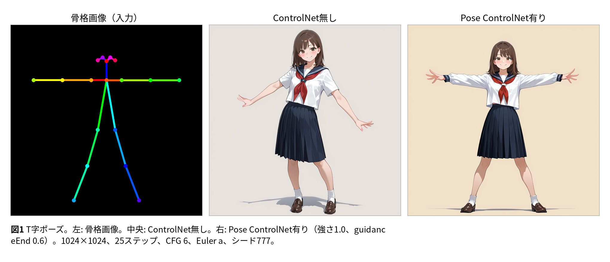

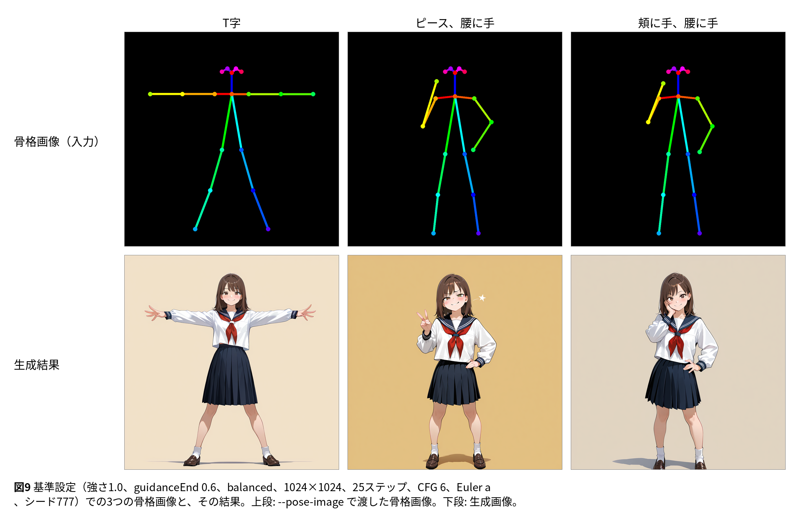

この節の画像はいずれも、本体モデルがWAI / Illustrious v11（SDXL）、1024×1024、25ステップ、
CFG 6、Euler a、シード777で、このブランチをMacBook Air（M4、16GB）で動かして生成した。
プロンプトは `masterpiece, best quality, amazing quality, 1girl, solo, medium hair, brown hair,
brown eyes, serafuku, school uniform, standing, <ポーズのタグ>, smile, looking at viewer,
full body, simple background`、否定プロンプトは `bad quality, worst quality, worst detail,
sketch, censor, nsfw, bad anatomy, bad hands, extra digits, deformed, ugly` である。ポーズの
タグは、T字が `arms spread`、ピースが `v, hand on hip, smug`、頬に手が `hand on own cheek,
hand on hip`。生成時間は1024×1024・25ステップで1枚3分ほどである。

変わるのはポーズだけではなく、背景、構図、陰影も変わる。ControlNetは効かせている
ステップの間、ノイズ除去の進路そのものを変える。シードが固定するのは初期ノイズだけなので、
プロンプトが決めていないもの（ここでは「simple background」）は改めて決め直される。
背景を保ちたいなら、プロンプトで指定する。

### パラメータ依存性

基準値（強さ1.0、`guidanceEnd` 0.6、`balanced`、1024×1024、25ステップ、CFG 6、Euler a）から
一つずつ変えた。骨格はT字（プロンプトだけでは出ない。図1）とピース（プロンプトだけでも出る。
骨格は主に脚の開きと腕の位置を決める）の二つで行った。

結論を先に書く。1024×1024では、試したどの値でもポーズは再現された。強さ、`guidanceEnd`、
`controlImportance`、ステップ数、CFG、サンプラーのどれを変えても崩れない。目に見えて効くのは
解像度だけで、512×512でもポーズは骨格に従うが、色と質感が荒れる（配布元が1024以上を
推奨している理由である）。

| 項目 | 基準値 | 試した値 | ポーズへの影響 | 副作用 |
|---|---|---|---|---|
| `weight` | 1.0 | 0.5、0.7、0.85、1.0、1.2 | 無し。どの値でも再現 | 1.2で色が変わり始める（制服と背景が暗くなる） |
| `guidanceEnd` | 0.6 | 0.3、0.5、0.6、0.8、1.0 | 無し | 0.3は絵が少し変わる（制御が早く切れる）。1.0でも1024では縁取りは出ない |
| `controlImportance` | balanced | balanced、prompt、control | 無し | ほぼ無し |
| 解像度 | 1024 | 512、768、1024 | 無し。3つとも骨格に従う | 512は顔が平板で色が荒い。768と1024はきれい |
| ステップ数 | 25 | 10、20、25、30 | 無し。10で既にポーズは出る | 増やすと細部が整う |
| CFG | 6 | 4、6、8 | 無し | 8で色がやや濃い |
| サンプラー | Euler a | Euler a、DPM++ 2M Karras、DPM++ SDE Karras | 無し | DPM++ SDEは所要時間が2倍（6分対3分） |

同じ設定のControlNet無しと比べた画素差は、T字の1024の各変種で画素の約15%
（平均差20〜30/255）、512では95%（ポーズだけでなく絵全体が変わる）。

T字:

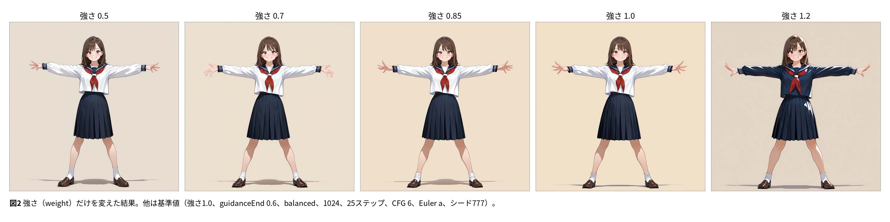

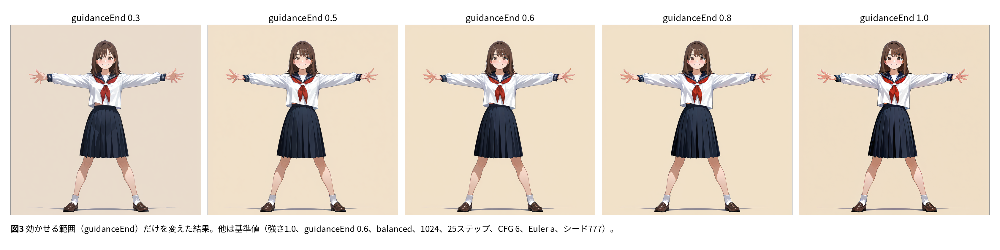

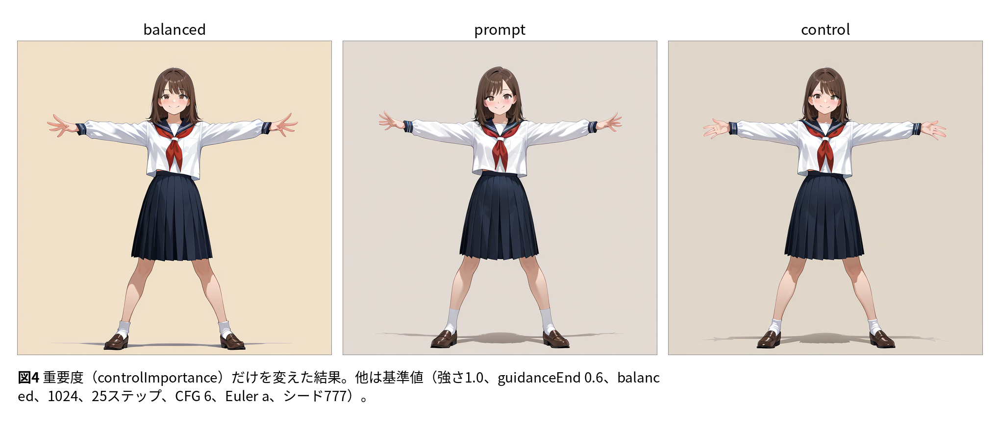

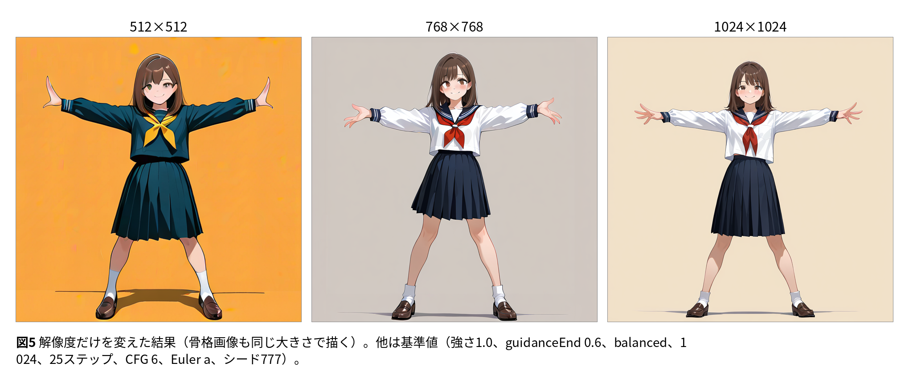

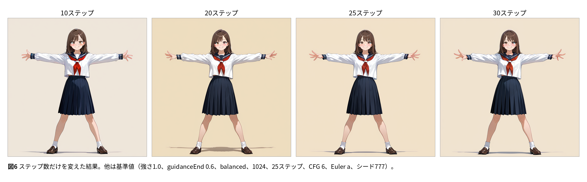

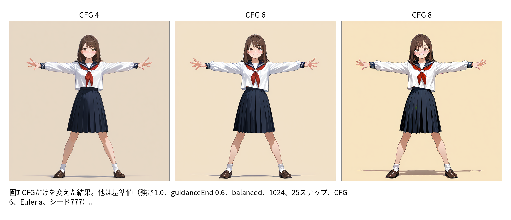

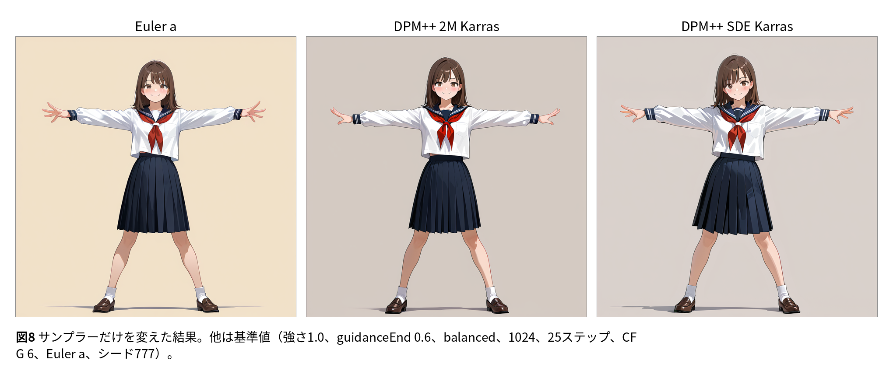

ピース:

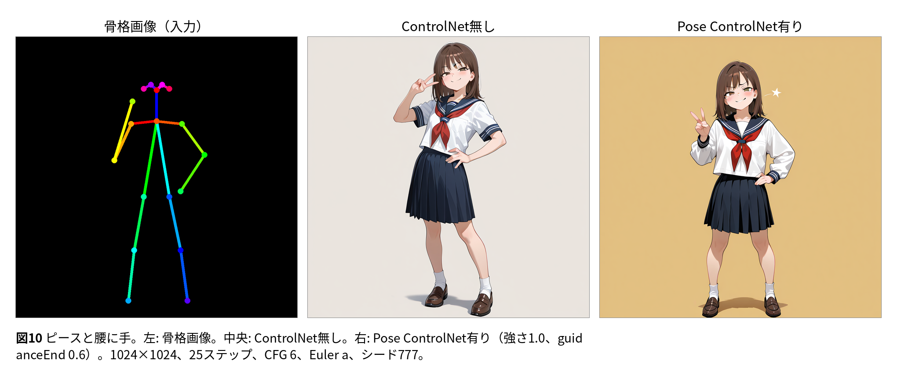

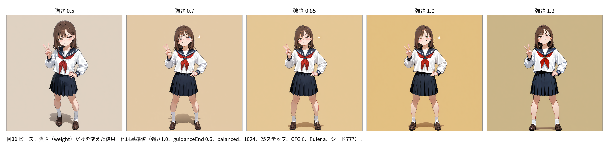

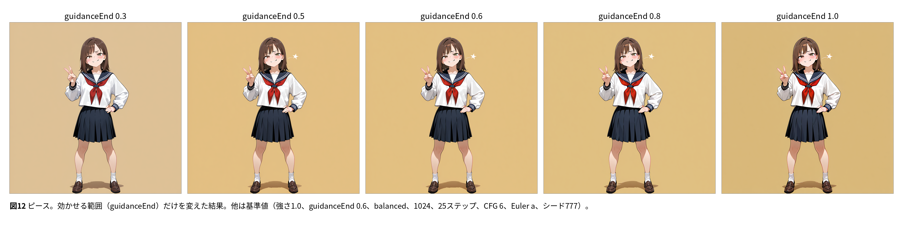

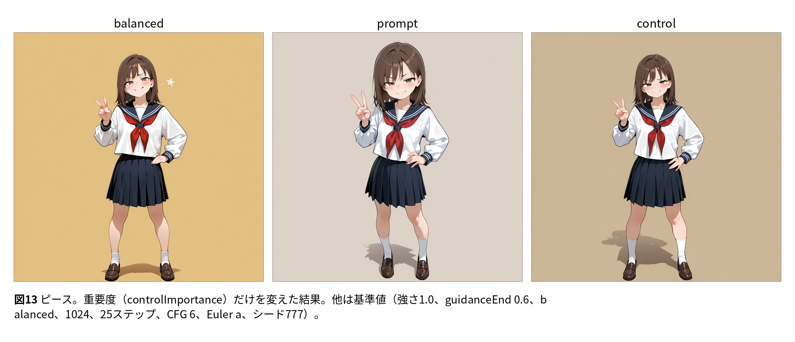

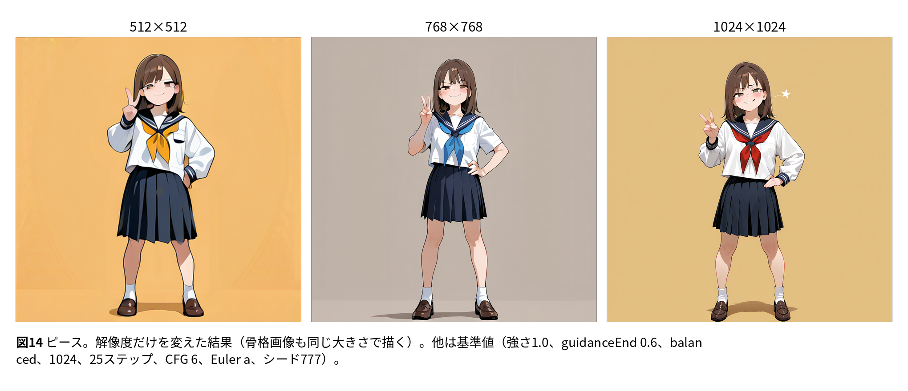

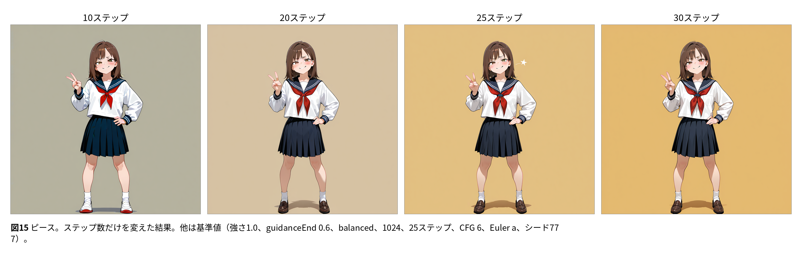

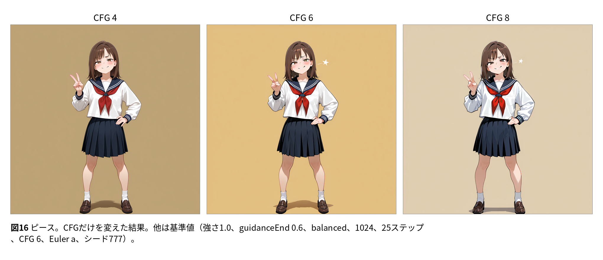

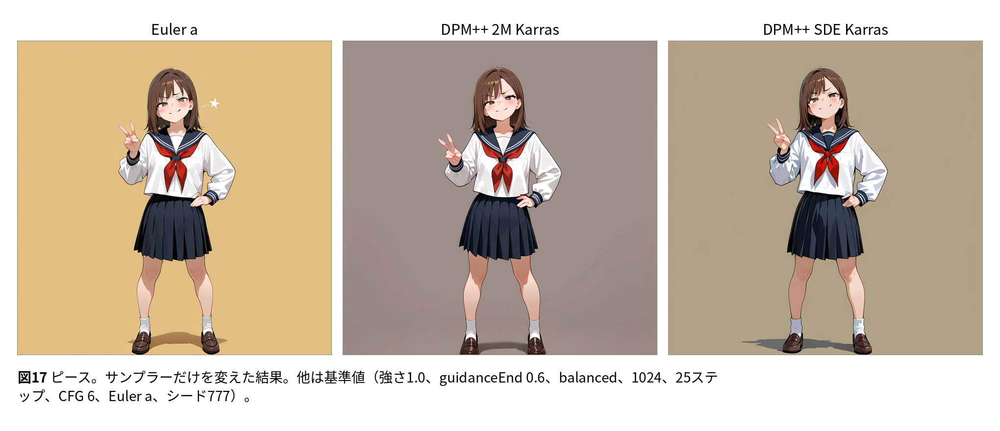

## 制限事項

- 写真から骨格を抽出する機能は無い。骨格画像はCLIの外で作る
- 検証は本体モデルがWAI / Illustrious（SDXL）で、Intel Mac（512×512、32ビット取り込み、
  1ステップ5分ほど）とMacBook Air M4（512から1024、16ビット取り込み、1024で1ステップ6秒ほど）
  で行った。Intel Macではエンジンの浮動小数点型が32ビットなので、取り込んだファイルは
  アプリが配布する16ビットのファイルの2倍の大きさになる。動作に問題はない
- 公式の統合型「Xinsir Union ProMax (SDXL)」の `pose` 種別は腕のポーズを再現しない。
  専用のOpenPoseモデルを使う
- GUIアプリはソースが非公開で、手を入れていない。GUI側の取り込み経路に同じ問題があるかは
  分からない
